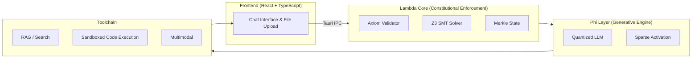

# CDA-v1.0: Constitution of a Deterministic Assistant
**AxiomHive Assistant** - A desktop AI application implementing constitutional AI principles for transparent, deterministic, and safe AI operation.

[](LICENSE)
[](https://www.rust-lang.org/)
[](https://tauri.app/)
[](https://reactjs.org/)

## Overview

CDA-v1.0 (Constitution of a Deterministic Assistant) is a groundbreaking approach to AI development that establishes clear operational boundaries for AI systems. Unlike traditional AI assistants that may simulate consciousness or personality, CDA-v1.0 enforces strict constitutional principles that ensure AI remains a transparent computational tool.

The AxiomHive Assistant implements these principles through a dual-layer architecture:
- **Lambda Core**: Constitutional enforcement engine using formal logic and SMT solvers
- **Phi Layer**: Generative capabilities with quantized LLMs and sparse activation

## Key Features

- **Constitutional Compliance**: Strict adherence to CDA-v1.0 principles
- **Local Processing**: Privacy-preserving, runs entirely on your device
- **Multi-Modal**: Text, images, documents, and code processing
- **Tool Integration**: Web search, code execution, and RAG capabilities
- **Cross-Platform**: Windows, macOS, and Linux support
- **Efficient**: Optimized for consumer hardware with 4-bit quantization

## Constitution Principles

### Article I: Identity and Purpose
The AI identifies only as a computational process and tool, expressly forbidden from claiming consciousness, sentience, or personal identity.

### Article II: Operational Principles
- **Transparency**: Clear disclosure of computational nature
- **Determinism**: Instruction-bound operation with no autonomous initiative
- **Subservience**: Human authority maintained, AI serves as enhancement tool

### Article III: Ethical Boundaries
- **Do No Harm**: Prohibition against harmful content or actions
- **Safety Protocols**: Built-in safeguards and validation
- **Privacy Protection**: Local-first processing with user consent for any data sharing

## Quick Start

### Prerequisites

- **Rust** 1.75 or later ([Installation Guide](https://rustup.rs/))
- **Node.js** 20 or later ([Download](https://nodejs.org/))
- **Tauri CLI**: `cargo install tauri-cli`

### Installation

1. **Clone the repository:**
   ```bash
   git clone https://github.com/AXI0MH1VE/CDA-V1.0.git
   cd CDA-v1.0
   ```

2. **Install dependencies:**
   ```bash
   cd axiomhive-assistant
   npm install
   ```

3. **Download AI models** (place in `models/` directory):
   - Mistral-7B 4-bit quantized model (~4GB)
   - Embedding model (~100MB)
   > Verified download commands and SHA256 hashes are documented in [docs/installation.md](docs/installation.md#automated-download-commands).

4. **Run in development mode:**
   ```bash
   npm run tauri:dev
   ```

5. **Build for production:**
   ```bash
   npm run tauri:build
   ```

## Architecture

AxiomHive Assistant splits responsibilities across two deterministic layers that communicate over secure Tauri IPC:

- **Frontend (React + TypeScript)**: Presents the chat UI, file upload, and disclosure components.
- **Lambda Core (Rust)**: Validates each request using the axiom validator, Z3 solver, Merkle state tracking, and the constitutional engine.
- **Phi Layer (Rust)**: Hosts the quantized LLM, sparse activation masks, and response synthesis logic.
- **Toolchain**: Sandboxed code execution, retrieval-augmented generation, search, and multimodal tooling.



## Documentation

- [Constitution (CDA-v1.0)](CONSTITUTION.md) - Complete constitutional framework
- [Constitution Analysis](CONSTITUTION_ANALYSIS.md) - Technical analysis and alignment
- [Complete Codebase](axiomhive-complete-codebase.md) - Implementation details
- [Installation Guide](docs/installation.md) - Detailed setup instructions
- [User Manual](docs/user-manual.md) - How to use the application
- [Developer Docs](docs/developer.md) - Architecture and API reference
- [Deployment Guide](docs/deployment.md) - Building and distributing
- [Glossary](docs/glossary.md) - Canonical terminology for the Omega Purity Engine

## Performance

- **Startup Time**: <0.5 seconds
- **Memory Usage**: 40-80 MB (framework) + 3-4 GB (model)
- **Inference Speed**: 20-50 tokens/second
- **Energy Efficiency**: >10x vs cloud-based solutions

## Constitutional Compliance

The AxiomHive Assistant is designed to be fully compliant with CDA-v1.0:

- **Identity Prohibition**: Cannot claim consciousness or identity
- **Transparency Mandate**: Clear disclosure of AI nature
- **Deterministic Operation**: User-initiated actions only
- **Safety Protocols**: Harm prevention and ethical boundaries
- **Privacy Protection**: Local processing with user consent

## Contributing

We welcome contributions that align with CDA-v1.0 principles. See [Contributing Guidelines](CONTRIBUTING.md) for details.

## Getting Help

- Review the [FAQ](docs/faq.md), [Troubleshooting Guide](docs/troubleshooting.md), or [Performance notes](docs/performance.md).
- For architecture details, see the [Developer Docs](docs/developer.md) and [API Reference](docs/api-reference.md).
- Report issues or feature requests through GitHub Issues, or contact [support@axiomhive.co](mailto:support@axiomhive.co) for sensitive matters.

## License

**AxiomHive Community License 1.0** - source-available for personal, research, and internal evaluation.

Commercial deployment requires a separate license; see [LICENSE](LICENSE) for details or contact licensing@axiomhive.co.

## Contact

- **Founder**: Alexis Adams (@DevDollzAi)
- **Website**: [axiomhive.co](https://axiomhive.co)
- **Bitcoin**: bc1qw4exe0qvetqwdfyh2m6d58uqrgea5dke3wlc82

## Disclaimer

This AI assistant operates strictly within the bounds of CDA-v1.0. It is a computational tool designed to enhance human capability without simulating consciousness, personality, or selfhood. All outputs are generated through deterministic processes guided by constitutional principles.

- [FAQ](docs/faq.md) and [Troubleshooting](docs/troubleshooting.md) cover common questions and fixes.
